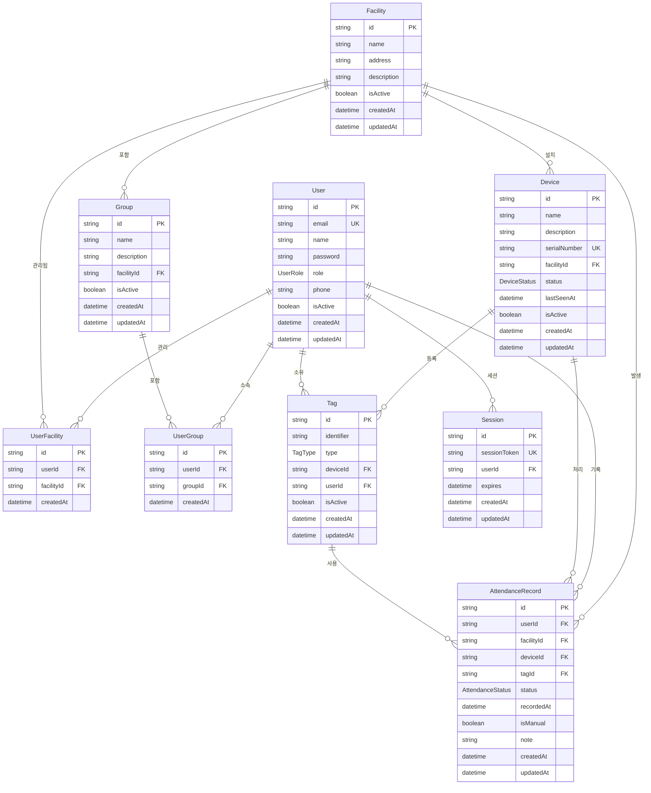

# 전자출결 시스템 ERD (Entity Relationship Diagram)

## 엔터티 구조

## ENUM 정의

### UserRole

- `INTERNAL_ADMIN`: 내부 관리자 (전체 시스템 관리)
- `FACILITY_MANAGER`: 시설 관리자 (시설별 관리)
- `USER`: 일반 사용자 (출결 대상자)

### AttendanceStatus

- `CHECK_IN`: 입실/출근
- `CHECK_OUT`: 퇴실/퇴근

### TagType

- `NFC`: NFC 태그
- `QR_CODE`: QR 코드
- `RFID`: RFID 태그
- `BEACON`: 비콘 신호

### DeviceStatus

- `ONLINE`: 정상 작동
- `OFFLINE`: 오프라인
- `MAINTENANCE`: 점검 중

## 주요 관계 설명

### 1. 사용자와 시설 관리 관계

- **UserFacility**: 시설 관리자가 어떤 시설을 관리하는지 다대다 관계
- 한 시설 관리자가 여러 시설을 관리할 수 있음
- 한 시설에 여러 관리자가 있을 수 있음

### 2. 사용자와 그룹 소속 관계

- **UserGroup**: 사용자가 어떤 그룹에 속하는지 다대다 관계
- 한 사용자가 여러 그룹에 속할 수 있음 (같은 시설 내에서)
- 한 그룹에 여러 사용자가 속할 수 있음

### 3. 시설과 하위 엔터티 관계

- **Facility → Group**: 일대다 (한 시설에 여러 그룹)
- **Facility → Device**: 일대다 (한 시설에 여러 장치)
- **Facility → AttendanceRecord**: 일대다 (한 시설에서 여러 출결 기록)

### 4. 장치와 태그 관계

- **Device → Tag**: 일대다 (한 장치에 여러 태그)
- **User → Tag**: 일대다 (한 사용자가 여러 태그 소유 가능)

### 5. 출결 기록 관계

- **AttendanceRecord**: 사용자, 시설, 장치, 태그를 모두 참조
- 실제 출결 이벤트 발생 시 모든 관련 정보를 기록

## 데이터 무결성 정책

### DB 레벨 제약조건 (기본 안전망)

- `User.email`: 이메일 중복 방지
- `Device.serialNumber`: 장치 시리얼 번호 중복 방지
- `Tag(identifier, type)`: 기본 중복 방지 (하이브리드 접근)
- `UserFacility(userId, facilityId)`: 중복 관리 관계 방지
- `UserGroup(userId, groupId)`: 중복 그룹 소속 방지
- `Session.sessionToken`: 세션 토큰 중복 방지

### 애플리케이션 레벨 추가 검증

- **태그 고유성**: 같은 장치 내에서 identifier + type 조합 유니크
- **비활성 태그 처리**: 비활성 태그는 중복 체크에서 제외 가능
- **비즈니스 로직**: 시설별, 그룹별 추가 제약조건
- **동시성 처리**: 트랜잭션을 통한 Race condition 방지

## 비즈니스 규칙

### 1. 권한 관리

- `INTERNAL_ADMIN`: 모든 시설 및 사용자 관리 가능
- `FACILITY_MANAGER`: UserFacility 관계로 연결된 시설만 관리 가능
- `USER`: 본인의 출결 기록만 조회 가능

### 2. 태그 관리 규칙

- 태그는 하나의 사용자에게만 할당 가능 (userId nullable for 미할당 상태)
- 같은 타입의 태그 identifier는 기본적으로 유니크
- 복잡한 유니크 규칙은 애플리케이션에서 처리

### 3. 출결 처리 규칙

- 수동 출결 기록은 `isManual = true`로 구분
- 출결 기록 수정 시 `note` 필드에 사유 기록
- 장치 상태는 실시간 모니터링을 위해 `lastSeenAt` 필드 사용

## 인덱스 전략

### 성능 최적화를 위한 인덱스

- `AttendanceRecord`:
  - `userId + recordedAt` (사용자별 출결 기록 조회)
  - `facilityId + recordedAt` (시설별 출결 현황 조회)
  - `recordedAt` (전체 출결 기록 시간순 조회)
- `Tag`:
  - `deviceId` (장치별 태그 조회)
  - `userId` (사용자별 태그 조회)
- `UserGroup`:
  - `groupId` (그룹별 사용자 조회)
- `UserFacility`:
  - `facilityId` (시설별 관리자 조회)

## 확장성 고려사항

### 1. 태그 타입 확장

- 새로운 태그 타입 추가 시 ENUM 업데이트
- 각 타입별 특수 속성은 JSON 필드로 확장 가능

### 2. 권한 시스템 확장

- 현재 단순 ENUM 구조
- 향후 Role-Permission 테이블로 확장 가능

### 3. 출결 상태 확장

- 현재 CHECK_IN/CHECK_OUT만 지원
- 향후 지각, 조퇴, 외출 등 상태 확장 가능
